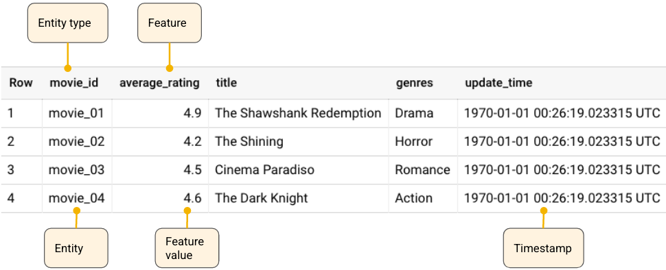

# Vertex Feature Store

## Instructions

### Environment Setup

1. Create a virtual environment using Python 3.8.12 (using something like venv or conda)

1. Install dependencies:

    ```
    % pip install google-cloud-aiplatform
    ```

1. Create a [GCP service account](https://cloud.google.com/docs/authentication/getting-started), and follow the instructions to download a JSON key and expose the location through `GOOGLE_APPLICATION_CREDENTIALS` environment variable

### Feature store setup

1. Choose a project and GCP location to use, and set these as environment variables:
    ```
    % export PROJECT='vertex-ai-feature-store'
    % export LOCATION='us-east1'
    ```

1. Upload `data/us-covid.csv` to Google Cloud Storage. Store the URL for this object in an environment variable:
    ```
    export IMPORT_INPUT_URI="gs://us-covid/us-covid.csv"
    ```

1. Run script:
    ```
    % python src/setup.py
    ```

### Online serving

1. Run script:
    ```
    % python src/online-serving.py
    ```

### Offline batch

1. Upload `data/us-covid.csv` to Google Cloud Storage. Store the URL for this object in an environment variable:
    ```
    % export BATCH_INPUT_URI="gs://us-covid/batch-input.csv"
    ```

1. Set an environment variable for GCS URI prefix in which the output dataset should be stored:
    ```
    % export BATCH_OUTPUT_URI_PREFIX="gs://us-covid/"
    ```

2. Run script:
    ```
    % python src/offline-batch.py
    ```

### Clean Up

1. Run script:
    ```
    % python src/clean-up.py
    ```

1. Optionally, delete the objects in Google Cloud Storage

### Sample Output

If everything goes well, the above should output something like this:

```
% time python src/setup.py
Creating feature store: projects/xxxxxxxxxxxx/locations/us-east1/featurestores/us_covid/operations/xxxxxxxxxxxxxxxxxxx
Response: name: "projects/xxxxxxxxxxxx/locations/us-east1/featurestores/us_covid"

Creating 'state' entity: projects/xxxxxxxxxxxx/locations/us-east1/featurestores/us_covid/entityTypes/state/operations/xxxxxxxxxxxxxxxxxxx
Response: name: "projects/xxxxxxxxxxxx/locations/us-east1/featurestores/us_covid/entityTypes/state"

Creating 'death' feature: projects/xxxxxxxxxxxx/locations/us-east1/featurestores/us_covid/operations/xxxxxxxxxxxxxxxxxxx
Response: name: "projects/xxxxxxxxxxxx/locations/us-east1/featurestores/us_covid/entityTypes/state/features/death"

Creating 'hospitalized' feature: projects/xxxxxxxxxxxx/locations/us-east1/featurestores/us_covid/operations/xxxxxxxxxxxxxxxxxxx
Response: name: "projects/xxxxxxxxxxxx/locations/us-east1/featurestores/us_covid/entityTypes/state/features/hospitalized"

Importing data: projects/xxxxxxxxxxxx/locations/us-east1/featurestores/us_covid/entityTypes/state/operations/xxxxxxxxxxxxxxxxxxx
Response: imported_entity_count: 19950
imported_feature_value_count: 32312
invalid_row_count: 830

python src/setup.py  1.32s user 0.22s system 0% cpu 6:38.54 total
% time python src/online-serving.py
header {
  entity_type: "projects/xxxxxxxxxxxx/locations/us-east1/featurestores/us_covid/entityTypes/state"
  feature_descriptors {
    id: "death"
  }
  feature_descriptors {
    id: "hospitalized"
  }
}
entity_view {
  entity_id: "DC"
  data {
    value {
      int64_value: 1030
      metadata {
        generate_time {
          seconds: 1615075200
        }
      }
    }
  }
  data {
  }
}

python src/online-serving.py  1.32s user 0.34s system 48% cpu 3.396 total
% time python src/offline-batch.py   
Generating batch data: projects/xxxxxxxxxxxx/locations/us-east1/featurestores/us_covid/operations/xxxxxxxxxxxxxxxxxxx
Response:
python src/offline-batch.py  1.07s user 0.18s system 1% cpu 1:18.83 total
% time python src/clean-up.py     
Deleting feature store: projects/xxxxxxxxxxxx/locations/us-east1/operations/xxxxxxxxxxxxxxxxxxx
Response:
python src/clean-up.py  1.09s user 0.19s system 77% cpu 1.652 total
```

## Data Model



## Notes

* On 2021/10/30, importing 2 features for 1 entity from a 2.6MB CSV (20,780 rows) took 5 min 34 sec when using a single node. (~62 instances/sec)

### Pros
* Creating entity and populating with features in console intuitive, quick
* Documentation includes code snippets (HTTP API, CLI, Python client)

### Cons
* Hard to troubleshoot batch ingestion jobs, and no fail fast method to determine why a job not importing any data
* No way to preview data in store in console
* Strangeness with nulls. E.g.,
    - "For online serving results, if the latest value for a feature is null, Vertex AI Feature Store returns the latest non-null value." [source](https://cloud.google.com/vertex-ai/docs/featurestore/serving-online)
    - "Vertex AI Feature Store doesn't support non-scalar null values like a null value in an array" [source](https://cloud.google.com/vertex-ai/docs/featurestore/ingesting-batch#nullnan_values_and_empty_arrays)
* Setup is tedious, client is bulky

### Limitations
* "Note that you can only have one batch ingestion job running per entity type to avoid any collisions." [source](https://cloud.google.com/vertex-ai/docs/featurestore/ingesting-batch)
* "To ensure consistency between online and batch serving requests, wait until the ingestion job is complete before making any serving requests." [source](https://cloud.google.com/vertex-ai/docs/featurestore/ingesting-batch#overwrite_existing_data_in_a_featurestore)
